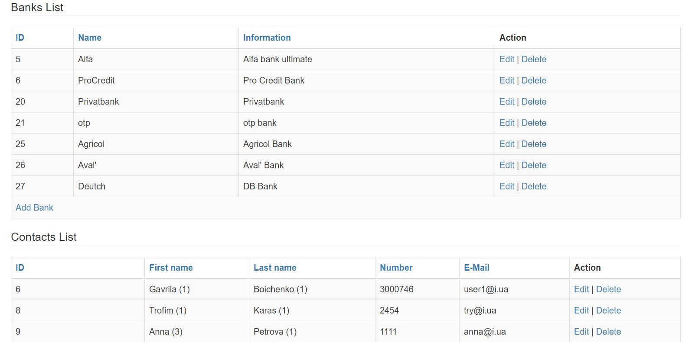

# Spring + MongoDB

It is web application using spring mvc, core, web, mongodb which will allow to create/update/delete/search contact, address, bank entities.
Some of them has db ref to other. For it cascading operation is implemented.

There is integration test for testing crud and aggregation operations 

### Build
```
mvn clean package
```
### Application sample
